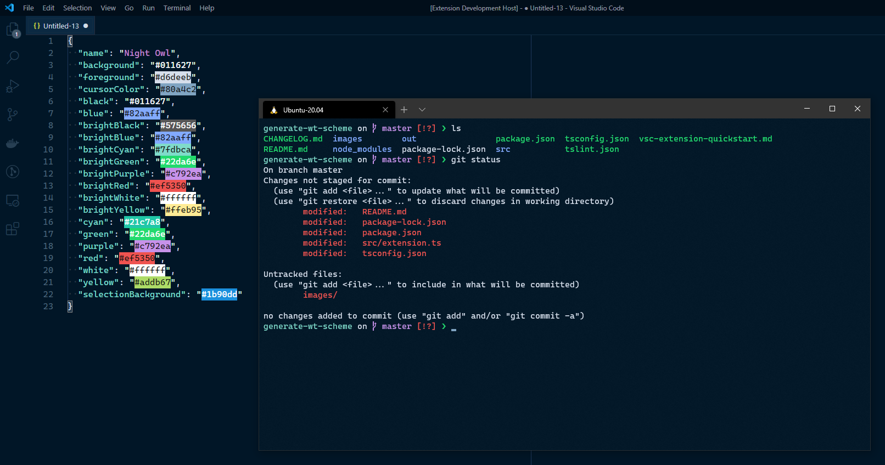
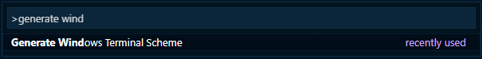

# Generate Windows Terminal Scheme

Provides a command to generate a Windows Terminal color scheme from your currently active
VSCode color theme, to enable easily matching WT with VSCode for beautiful dev
environments.

_Using the [Night Owl](https://marketplace.visualstudio.com/items?itemName=sdras.night-owl) theme_

## Usage

First, run the `Generate Windows Terminal Scheme` command:

You will be prompted to enter the theme name because unfortunately at this time there is
no VSCode API to get the name of the current active theme (if you know of one, please let
me know!).

Once it completes, the result will be automatically copied to your clipboard.

Now open your WT settings file (`Ctrl+,` in WT by default), and paste the JSON into the `schemes` array.

See the
[docs](https://docs.microsoft.com/en-us/windows/terminal/customize-settings/profile-settings)
for more how to use WT color schemes.
